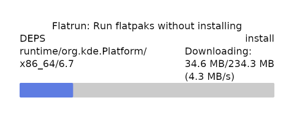
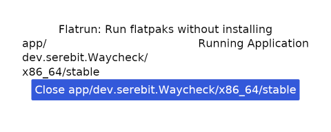

# Flatrun - Run Flatpaks without installing!

Run the graphical user interface:

```sh
flatpak run io.github.ryanabx.flatrun --gui
```

Or, run a .flatpak bundle straight from the terminal!:

```sh
flatpak run io.github.ryanabx.flatrun bundle [PATH]
```

> **NOTE:** Please help test this and [Submit ISSUES](https://github.com/ryanabx/flatrun/issues/new) when you come across them!

## Building/Installing

**Flatpak is the only supported method of building Flatrun**. Install `flatpak-builder` and run:

Build requirements: just and flatpak-builder installed through flatpak

```sh
flatpak install org.flatpak.Builder
just build-flatpak
```

## Screenshots





## Contributing

This project is open to fixes and new features! It'd be helpful to make an issue describing what you plan to implement to avoid duplicate work!