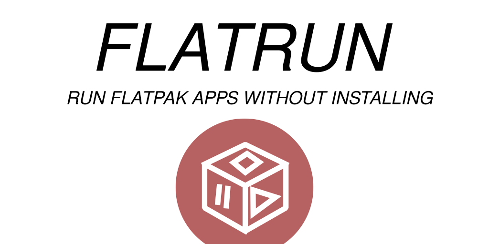

Run `flatrun run path <path_to_flatpak>` to run a .flatpak file!

Or, run a flatpak from flathub with `flatrun run name flathub <appid>`!

Try `flatrun --gui` to run the graphical interface!

> **NOTE:** Please help test this and [Submit ISSUES](https://github.com/ryanabx/flatrun/issues/new) when you come across them!

## Building/Installing

**Flatpak is the only supported method of building Flatrun**. Install `flatpak-builder` and run:

```sh
flatpak-builder --install --user .build flatpak/io.github.ryanabx.flatrun.yml
```